    readme.md
    
    :Author: kalipy
    :Email: kalipy@debian
    :Date: 2021-07-07 20:16

### activemq消息持久化机制之JDBC With Journal

是什么

配置

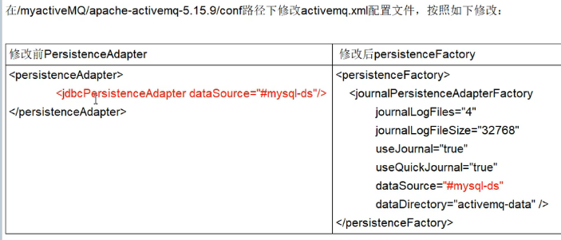

重启activemq

    ./activemq restart

测试

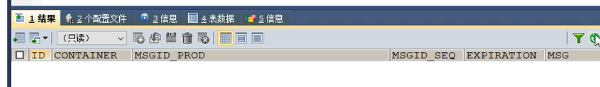

生产者生产了消息，而消费者没有消费时，数据库要过一段时间才会从缓存(缓存日志)同步到mysql磁盘。(数据被消费后，数据的删除也是先删除缓存里的，然后再过一段时间，才会删除mysql本地的)

### 持久化机制小总结

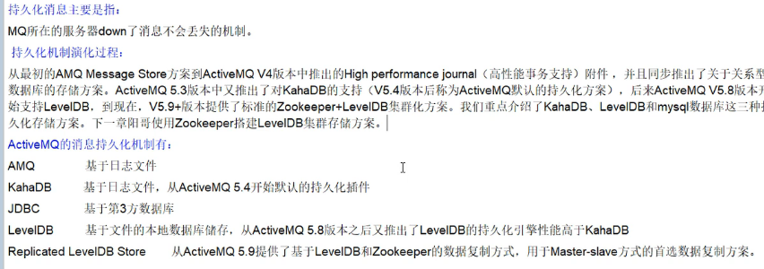

### zookeeper和replicated levelDB集群原理

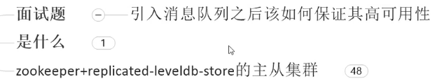

是什么

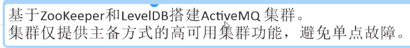

三种集群方式对比

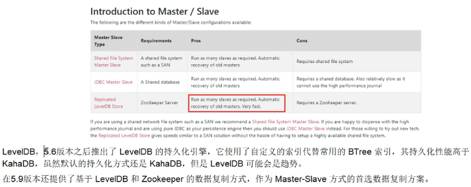

本次案例采用zookeeper+replicated LevelDB Store

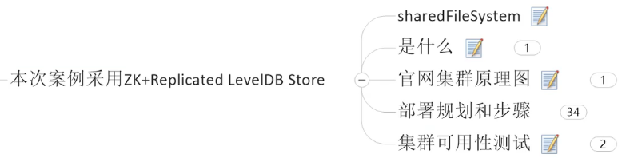

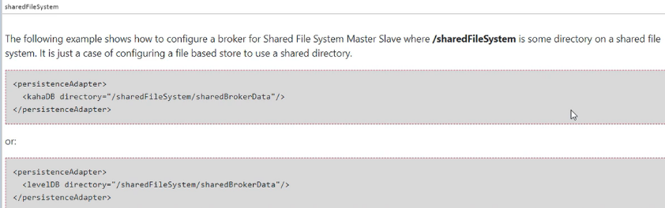

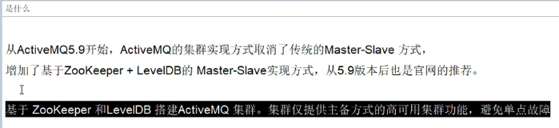

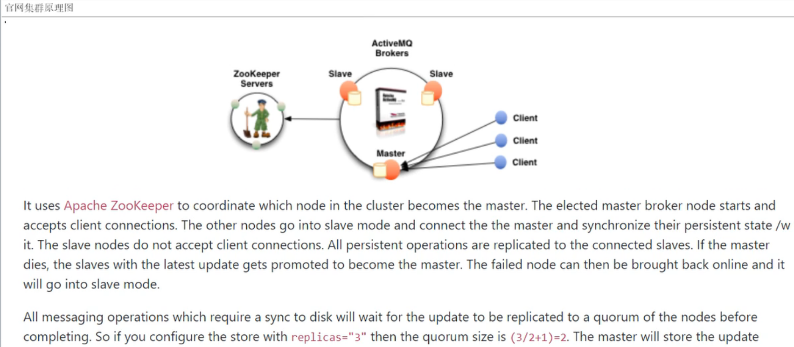

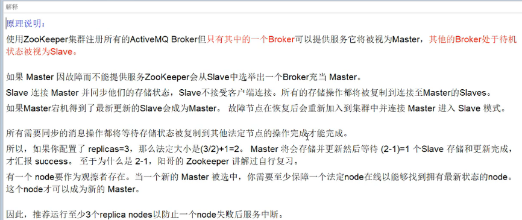

### 部署之前

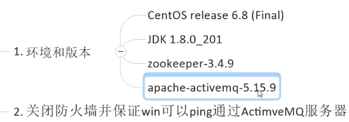

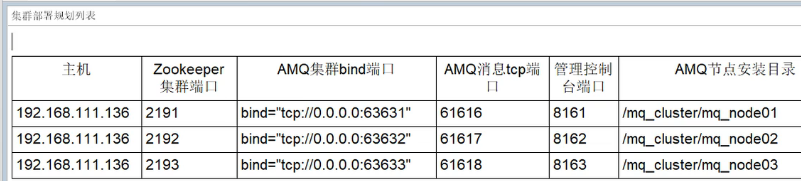

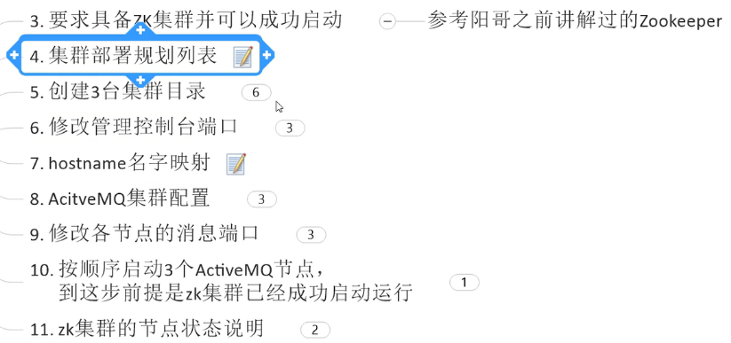

### 集群部署上

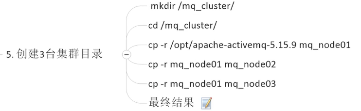

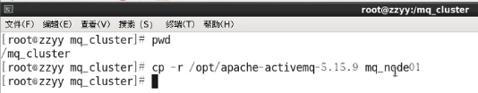

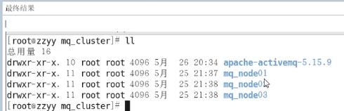

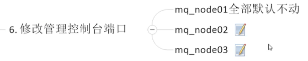

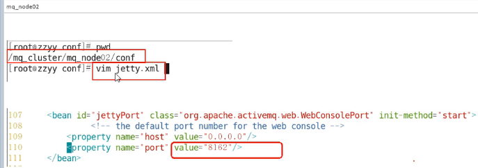

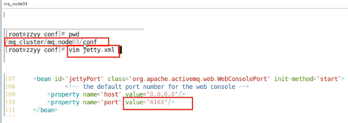

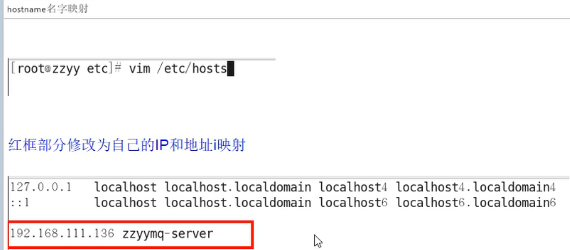

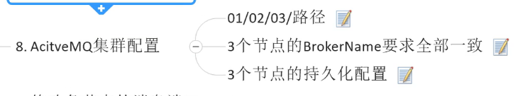

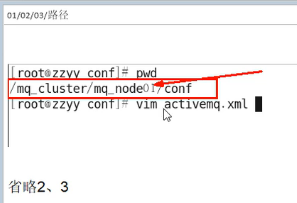

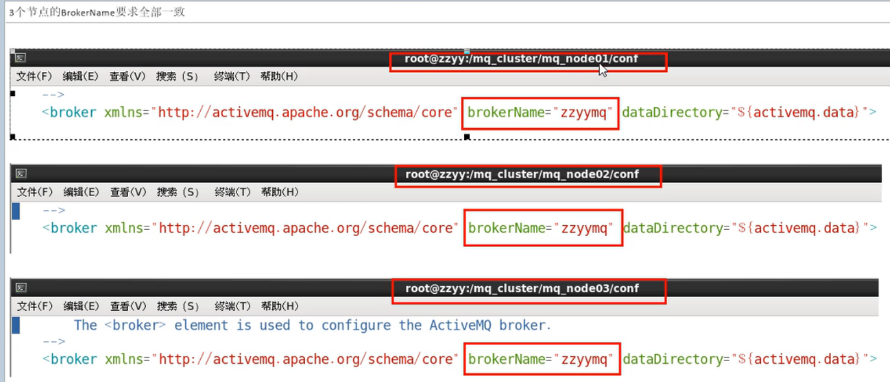

### 集群部署上

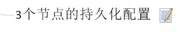

注意: 在最开始我们就说过,采用LevelDB:

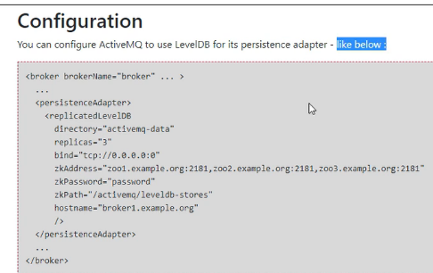

注释掉默认的kahadb:

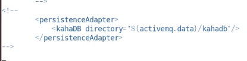

把这个一粘贴:

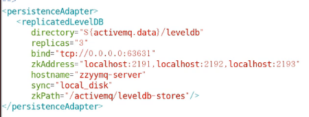

再配置node2:

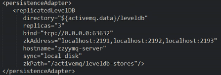

然后配置node3:

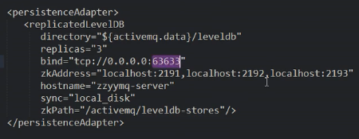

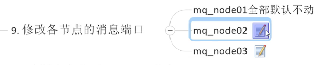

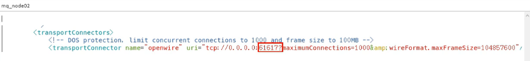

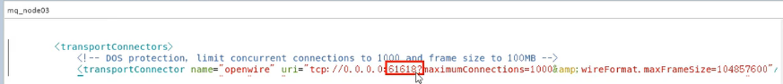

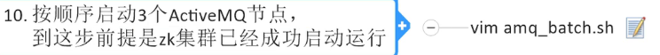

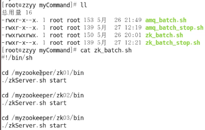

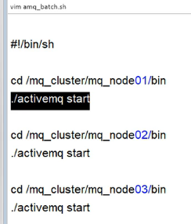

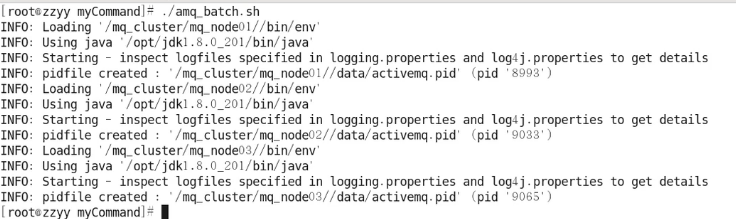

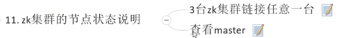

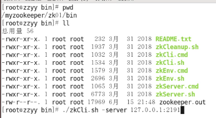

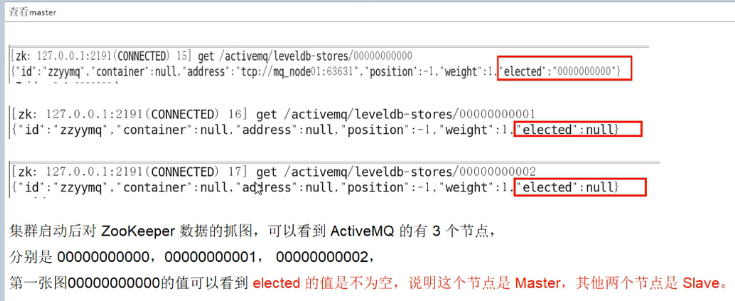

### Replicated LevelDB集群故障迁移和验证

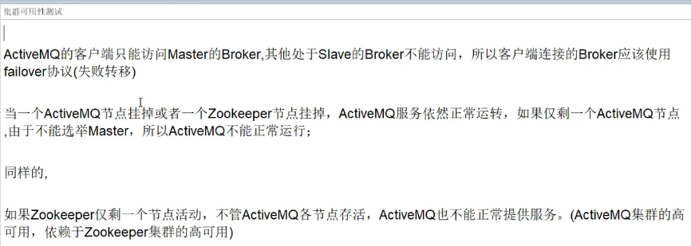

broker访问测试:

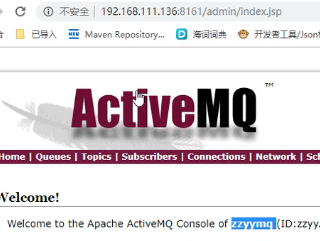

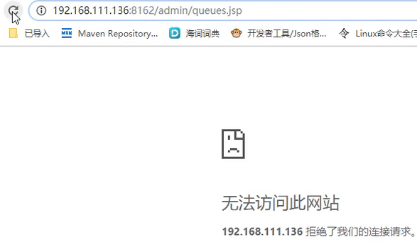

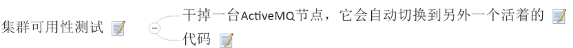

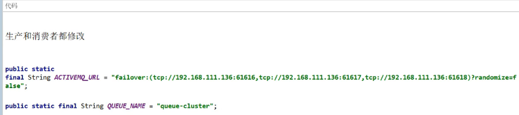

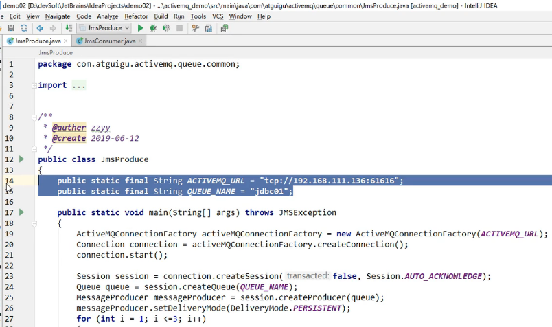

改为:

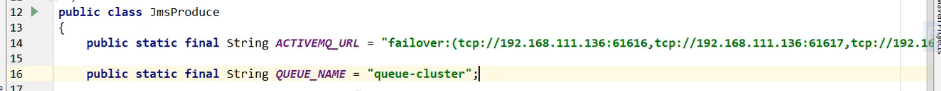

Consumer的也一样:

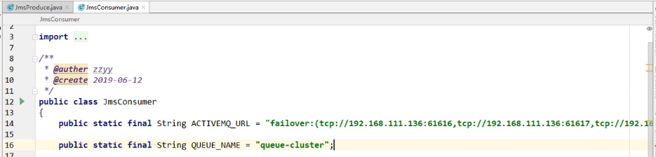

#### 正常情况下

先运行生产者生产消息:

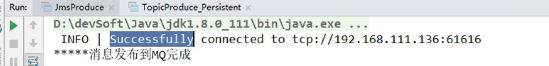

查看结果:

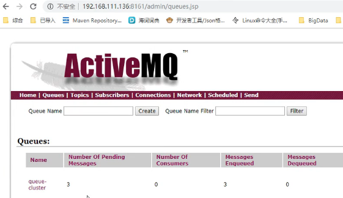

然后运行消费者消费消息:

#### 现在我们

我们现在干掉activemq_master:

可以看到现在8161就无法访问了:

但是选举出了新的activemq_master:

